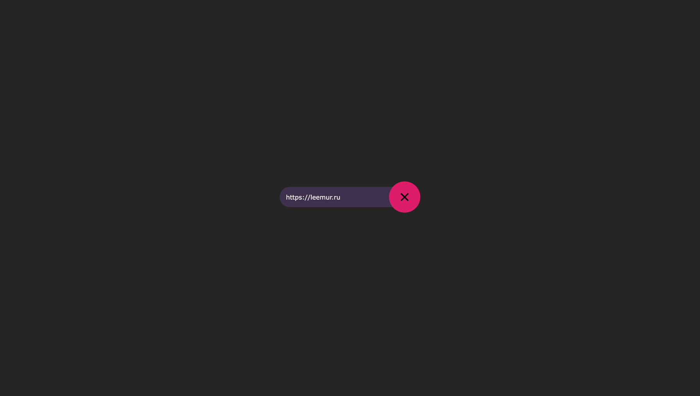
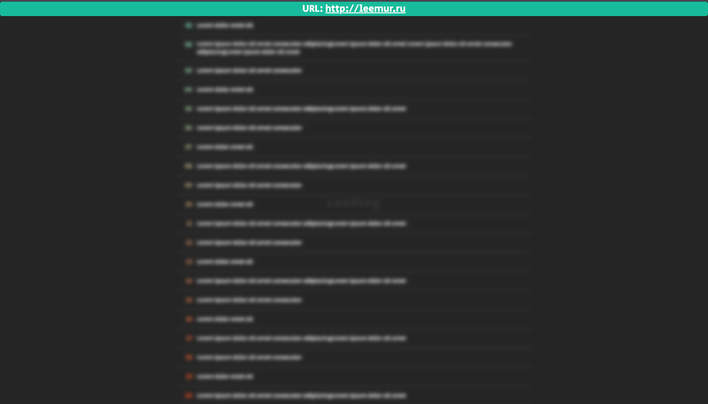
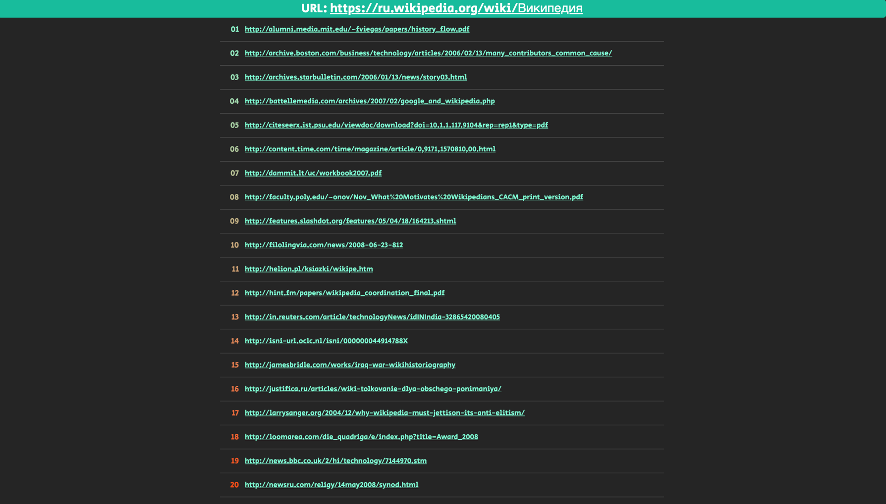

# Crawler

## Description (task)

After you click the "go" button, the app crawls all the URLs in the given webpage and displays to the customer
a complete list of all the URLs the crawler found, including nested links. So essentially what you need to do is
implement a simple web crawler in the form of a Django web app.

Take home part should not be a “production ready” solution, however we encourage you to write a clean and readable
code like you would do in real life.

## Technologies

- Django + DRF + django-celery-results + PostgreSQL
- Celery + RabbiMQ + PostgreSQL + Flower

## Makefile

- `make init`: initialize the project for development (copy .env.copy to .env)
- `make migrate`: perform migrations inside the django docker container
- `make create-superuser`: create a superuser in the django docker container
- `make help`: show this help

## Preview:

### Search page

### Loading task page

### Task page

## HTML elements links:

- [Search page](https://codepen.io/thebabydino/pen/PBXRRm)
- [List of links](https://codepen.io/equinusocio/pen/OqpBKJ)
- [Loader](https://codepen.io/kumarsidharth/pen/VBBbJW)
- [404 page](https://codepen.io/jh3y/pen/MWbvzKb)

## Inner details

1. The Csrf token send to the client using the `ensure_csrf_cookie` decorator, because by default
   django sets a cookie if you added `` to the html file.
2. celery_worker needs the django library because celery has fixups for django and check that django is installed.
3. `CELERY_RESULT_BACKEND_URL` has db+ prefix, because celery has `BACKEND_ALIASES` (celery.app.backends) dictionary (
   key - database type, value - class)
4. To solve problems with psycopg2, you need to install additional
   packages `RUN apk update && apk add gcc libpq-dev musl-dev`
5. By default celery create two tables **celery_taskmeta** and **celery_tasksetmeta**
6. django-celery-results create 3 tables:
    - **django_celery_results_taskresult**
    - **django_celery_results_groupresult**
    - **django_celery_results_chordcounter**
7. Without `CELERY_RESULT_EXTENDED = True` celery saves to database only task_id, status, result (in zipped format),
   date_done
8. Without `CELERY_TASK_TRACK_STARTED = True` celery doesn't add line to database with task status, only when task was
   finished
9. Django celery fixups is used by the `BUILTIN_FIXUPS` variable
10. Celery has no way to save the task in the backend of the result before sending
    it to the worker: [link1](https://github.com/celery/celery/issues/3596)
    and [link2](https://stackoverflow.com/questions/9824172/find-out-whether-celery-task-exists)
11. To print all queries in postgres `"postgres", "-c", "log_statement=all"`
12. Regex faster than BeautifulSoup: [proof](https://gist.github.com/leemurus/4ae757c615057836c68f132dc73977e1).